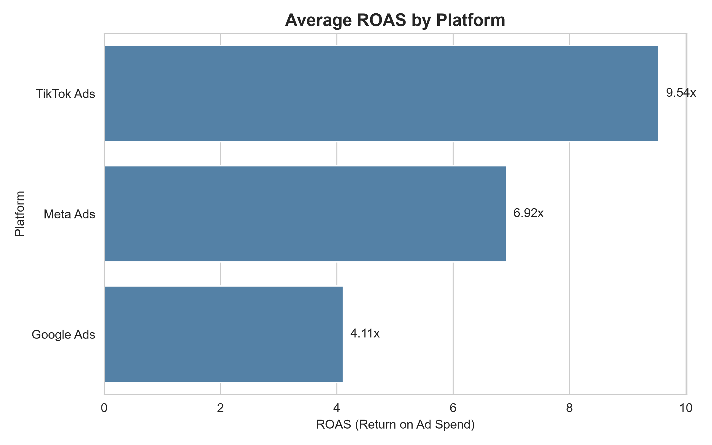
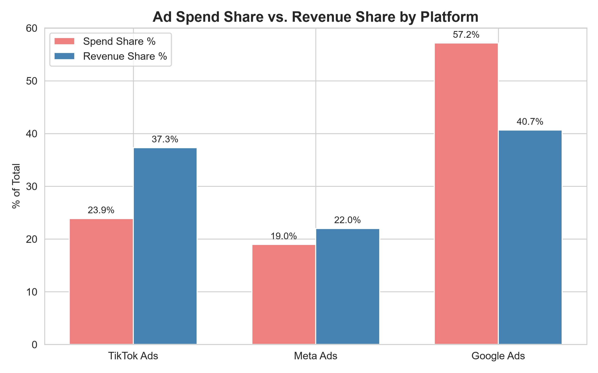
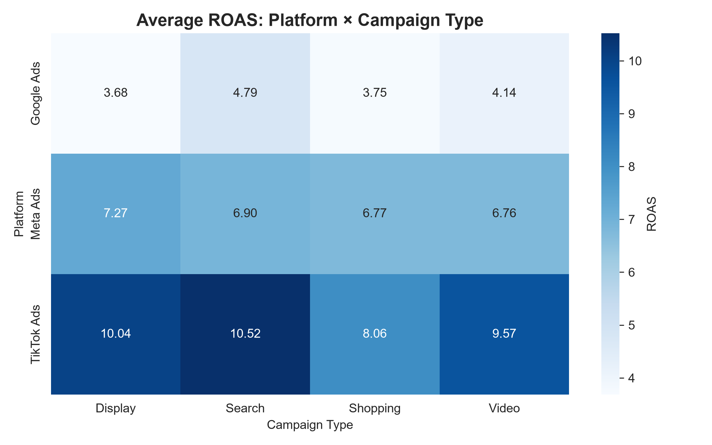

# Digital Marketing ROI Analyzer

A data-driven analysis of digital advertising campaign performance across platforms, identifying budget reallocation opportunities to improve overall marketing ROI.

## 📊 Key Finding

**TikTok Ads delivers 9.54x ROAS — more than double Google Ads (4.11x) — yet receives only 23.9% of total ad spend while Google Ads receives 57.2%.**



## 🎯 Business Recommendation

Reallocate a portion of Google Ads budget toward TikTok Ads — particularly Search and Display campaigns, TikTok's strongest formats (10.52x and 10.04x ROAS) — to improve overall marketing efficiency without increasing total spend.



## 🔍 Key Findings

1. **TikTok outperforms across every campaign type** — even its weakest format (Shopping, 8.06x) exceeds the best result on any other platform (Meta Search, 6.90x)
2. **Spend allocation doesn't match efficiency**: Google Ads generates only 40.7% of revenue despite receiving 57.2% of spend; TikTok generates 37.3% of revenue from just 23.9% of spend
3. Search campaigns (7.00x avg ROAS) outperform Shopping campaigns (5.98x) across platforms
4. EdTech (6.83x) is the highest-performing industry by ROAS; Fintech (6.03x) the lowest



## 📁 Dataset

1,800 campaign records (2024) across Google Ads, Meta Ads, and TikTok Ads, spanning 5 industries and 7 countries — including spend, revenue, conversions, CTR, CPC, CPA, and ROAS.

## 🛠️ Tech Stack

- Python, pandas, numpy
- matplotlib, seaborn (visualization)
- Jupyter Notebook

## 🚀 How to Run

```bash
git clone https://github.com/Soham006/marketing-roi-analyzer.git
cd marketing-roi-analyzer

python -m venv venv
venv\Scripts\activate   # Windows
source venv/bin/activate  # Mac/Linux

pip install -r requirements.txt
jupyter notebook 01_roi_analysis.ipynb
```

## 📈 Output

`platform_performance_summary.csv` — a summary table of CTR, CPC, CPA, ROAS, spend share, and revenue share by platform, ready for stakeholder review or further analysis.

## 👤 About

Built by **Soham Roy**, MBA candidate (Marketing & Analytics) at IMI Kolkata, with a B.Tech in Computer Science.
